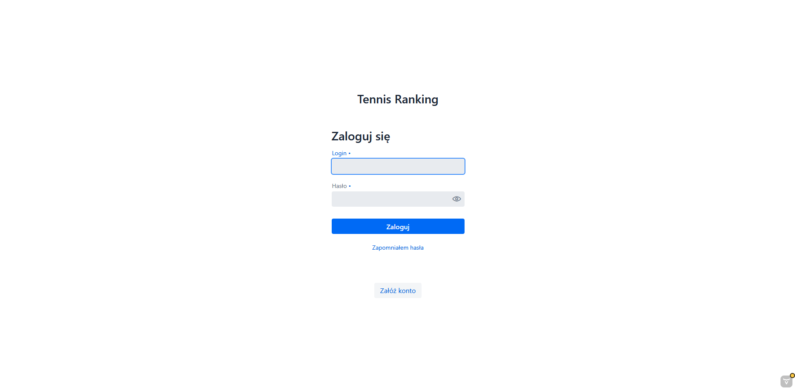
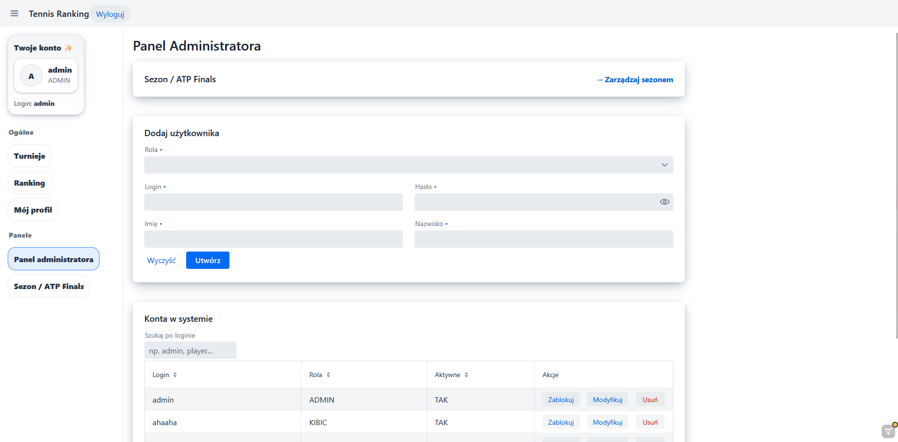
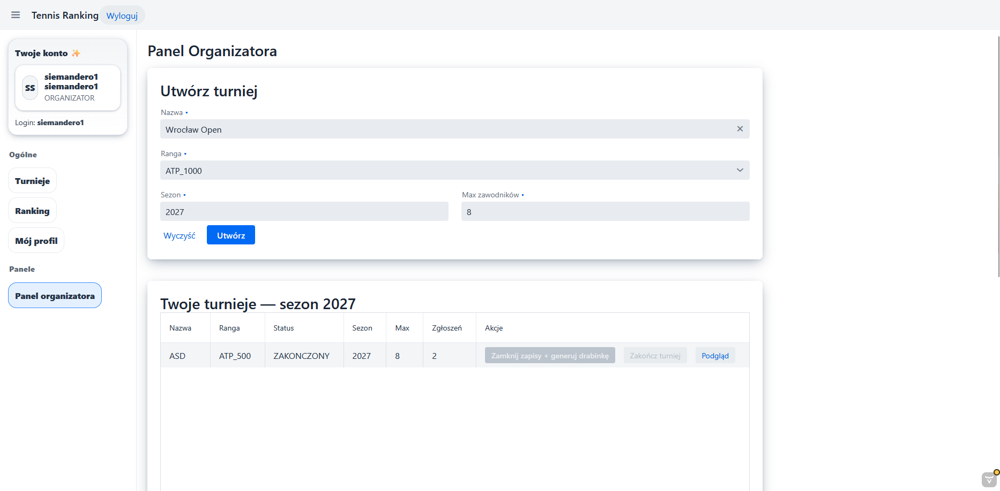
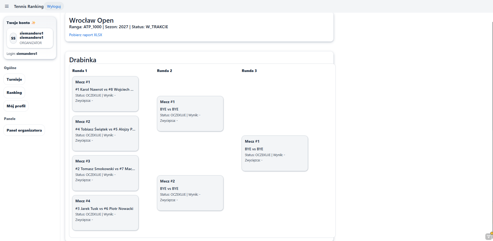
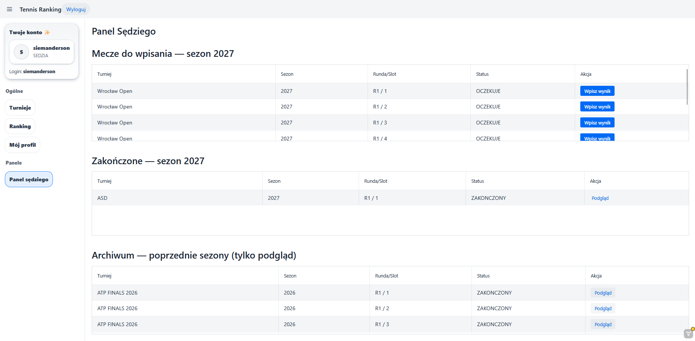
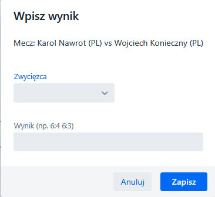
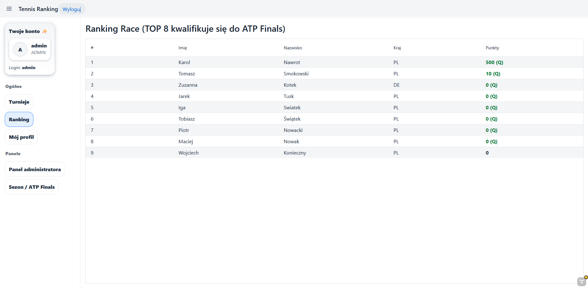
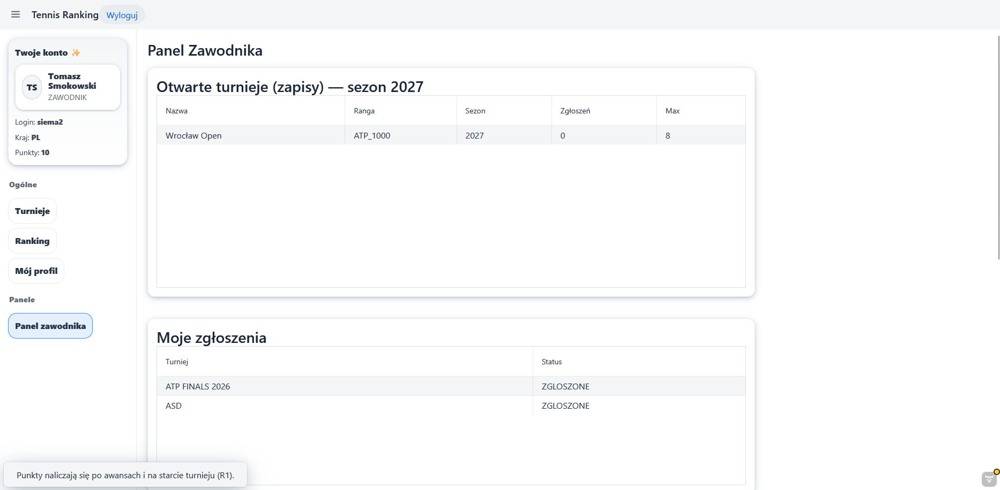

# 🎾 Tennis Ranking System

> System zarządzania rankingiem tenisa ziemnego — projekt akademicki z zakresu Baz Danych 2


---

## Opis projektu

Aplikacja webowa symulująca system rankingowy w tenisie ziemnym, wzorowana na strukturze rankingów ATP. System obsługuje pełny cykl życia sezonu — od jego otwarcia, przez organizację i rozgrywanie turniejów, aż po automatyczne przeliczanie punktów rankingowych i zamknięcie sezonu.

Projekt realizowany w ramach przedmiotu **Bazy Danych 2** i obejmuje projektowanie relacyjnej bazy danych, implementację logiki biznesowej po stronie serwera, zarządzanie transakcjami oraz kontrolę dostępu opartą na rolach użytkowników (RBAC).

---

## Funkcjonalności

### Administrator
- Otwieranie i zamykanie sezonu
- Otwieranie i zamykanie ATP Finals
- Zarządzanie użytkownikami systemu
- Podgląd pełnego stanu aplikacji

### Organizator turnieju
- Tworzenie i otwieranie nowych turniejów
- Generowanie drabinki turniejowej (bracket)
- Zarządzanie zgłoszeniami zawodników
- Zamykanie turnieju i aktualizacja punktacji

### Sędzia
- Podgląd przypisanych meczów
- Wpisywanie wyników meczów
- Weryfikacja wyników

### Zawodnik
- Rejestracja i logowanie
- Zgłoszenie do turnieju
- Podgląd własnych wyników i pozycji w rankingu

### Kibic (gość)
- Przeglądanie aktualnego rankingu
- Podgląd wyników turniejów
- Przeglądanie drabinek turniejowych

---

## Zrzuty ekranu

<table>
  <tr>
    <td align="center"><strong>Logowanie</strong></td>
    <td align="center"><strong>Panel Admina</strong></td>
  </tr>
  <tr>
    <td></td>
    <td></td>
  </tr>
  <tr>
    <td align="center"><strong>Panel Organizatora</strong></td>
    <td align="center"><strong>Wygenerowana Drabinka</strong></td>
  </tr>
  <tr>
    <td></td>
    <td></td>
  </tr>
  <tr>
    <td align="center"><strong>Panel Sędziego</strong></td>
    <td align="center"><strong>Wpisywanie Wyniku</strong></td>
  </tr>
  <tr>
    <td></td>
    <td></td>
  </tr>
  <tr>
    <td align="center"><strong>Ranking</strong></td>
    <td align="center"><strong>Panel Zawodnika</strong></td>
  </tr>
  <tr>
    <td></td>
    <td></td>
  </tr>
</table>

---

## Architektura

Projekt oparty na architekturze **Backend + Frontend** — Java Spring Boot jako REST API oraz osobna warstwa frontendowa (JavaScript).

```
src/main/
├── frontend/                        # Warstwa frontendowa (JS)
│   └── ...                         # Widoki / komponenty UI
└── java/pl/projekt/tennis_ranking/
    ├── model/                       # Encje domenowe (JPA)
    ├── repo/                        # Repozytoria (Spring Data JPA)
    ├── security/                    # Konfiguracja Spring Security
    ├── seed/                        # Dane inicjalizacyjne (seed)
    ├── service/                     # Logika biznesowa
    ├── views/                       # Kontrolery / widoki
    ├── AppShell.java
    └── TennisRankingApplication.java
```

### Stos technologiczny

| Warstwa | Technologia |
|---|---|
| Backend | Java 17+, Spring Boot 3.x |
| UI Framework | **Vaadin Flow** |
| Baza danych | MySQL (XAMPP) |
| ORM | Spring Data JPA / Hibernate |
| Bezpieczeństwo | Spring Security |
| Build | Maven |

> **Vaadin Flow** to framework pozwalający budować cały interfejs użytkownika w Javie — bez pisania HTML/CSS/JS ręcznie. Framework generuje frontend automatycznie, co wyjaśnia wysoką zawartość JavaScript w statystykach repozytorium (to kod samego Vaadina, nie pisany ręcznie).

---

## 🗄️ Model danych

System oparty jest na relacyjnej bazie danych z następującymi kluczowymi encjami:

- **Użytkownik / Rola** — system kont z przypisanymi rolami (Admin, Organizator, Sędzia, Zawodnik, Kibic)
- **Sezon** — zarządzanie cyklem rocznym, status otwarcia/zamknięcia
- **Turniej** — powiązany z sezonem, posiada kategorię punktową i drabinkę
- **Mecz** — powiązany z turniejem, zawiera wynik i sędziego
- **Ranking** — dynamicznie przeliczany na podstawie wyników z bieżącego sezonu
- **Zgłoszenie** — powiązanie zawodnika z turniejem

Schemat bazy danych dostępny w pliku [`tennis_ranking.sql`](tennis_ranking.sql).

---

## ⚙️ Uruchomienie

### Wymagania

- Java 17+
- Maven 3.8+
- XAMPP (MariaDB 10.4+)

### Kroki

1. **Sklonuj repozytorium**
   ```bash
   git clone https://github.com/HoszeQ/Projekt-BazyDanych2-RankingTenisaZiemnego2.git
   cd Projekt-BazyDanych2-RankingTenisaZiemnego2
   ```

2. **Uruchom XAMPP** i włącz moduł **MySQL** (oraz Apache jeśli potrzebny)

3. **Zainicjalizuj bazę danych**

   Otwórz phpMyAdmin (`http://localhost/phpmyadmin`), utwórz bazę danych `tennis_ranking`, następnie zaimportuj plik:
   ```
   tennis_ranking.sql
   ```
   Lub przez terminal MySQL:
   ```bash
   mysql -u root -p tennis_ranking < tennis_ranking.sql
   ```

4. **Skonfiguruj połączenie z bazą**

   W pliku `src/main/resources/application.properties`:
   ```properties
   spring.datasource.url=jdbc:mysql://localhost:3306/tennis_ranking
   spring.datasource.username=root
   spring.datasource.password=
   ```

4. **Uruchom aplikację**
   ```bash
   ./mvnw spring-boot:run
   ```

5. **Otwórz w przeglądarce**
   ```
   http://localhost:8080
   ```

---

## Bezpieczeństwo

System implementuje kontrolę dostępu opartą na rolach (RBAC) z wykorzystaniem Spring Security:

- Każda rola posiada dostęp wyłącznie do przypisanych jej widoków i operacji
- Hasła użytkowników przechowywane są w formie hashowanej (BCrypt)
- Sesje zarządzane po stronie serwera
- Walidacja danych wejściowych na poziomie kontrolera i warstwy serwisowej

---

## Główne decyzje projektowe

- **Drabinka eliminacyjna** generowana automatycznie po zamknięciu zgłoszeń, z losowym przydziałem zawodników do par (według zasad ATP/WTA)
- **Przeliczanie rankingu** odbywa się automatycznie po zakończeniu każdego turnieju — punkty są kumulowane w ramach sezonu
- **ATP Finals** obsługiwane jako odrębny, specjalny turniej kończący sezon, dostępny dla najlepszej ósemki zawodników rankingu
- **Rozdzielenie ról** gwarantuje, że np. sędzia nie może modyfikować struktury turnieju, a zawodnik nie może wpisywać wyników

---

## Kontekst akademicki

Projekt zrealizowany w ramach kursu **Bazy Danych 2**. Obejmuje:

- Projektowanie schematu relacyjnej bazy danych
- Implementację złożonych zapytań SQL i procedur
- Integrację z bazą danych przez ORM (Hibernate / JPA)
- Zarządzanie transakcjami i spójnością danych
- Implementację autentykacji i autoryzacji

---

## 👤 Autor

**HoszeQ** — [github.com/HoszeQ](https://github.com/HoszeQ)
